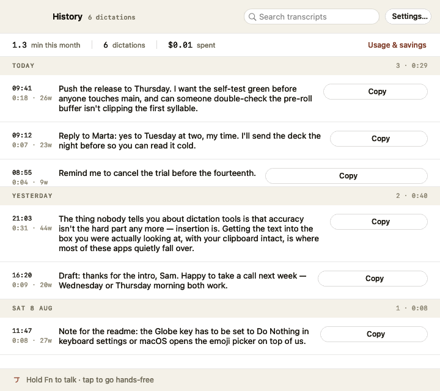
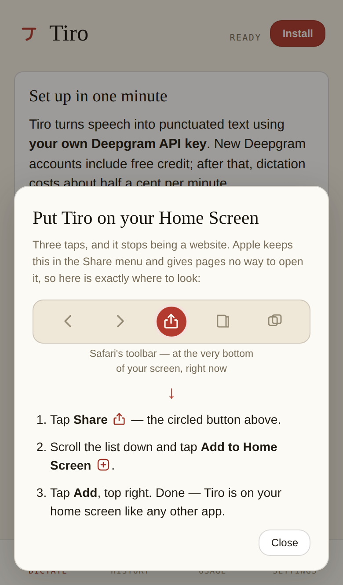
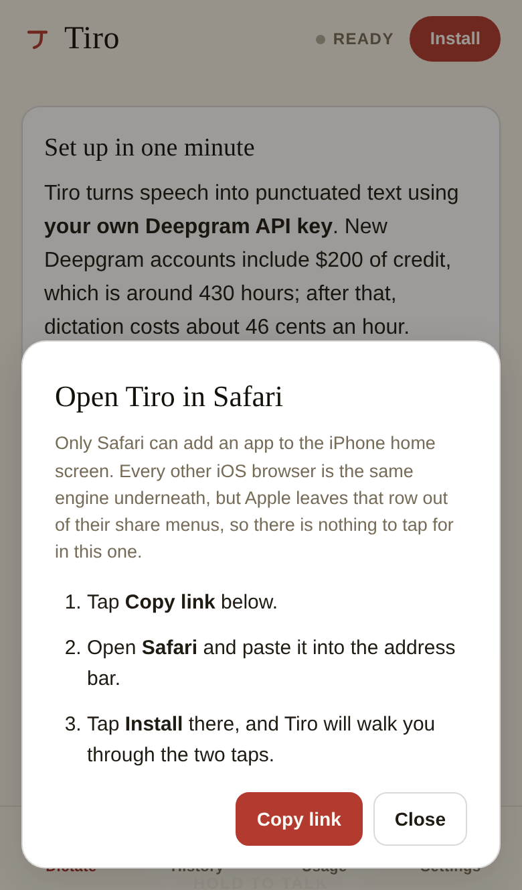
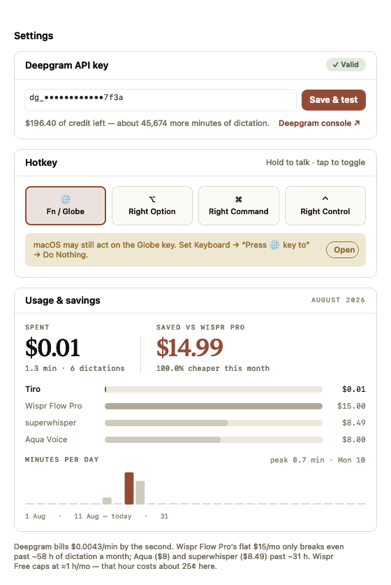
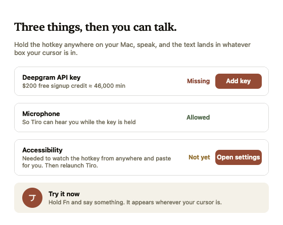

<div align="center">


# Tiro

**Hold a key. Speak. Your words land in whatever box your cursor is in.**

Dictation on the Mac, Windows and your phone, powered by [Deepgram](https://deepgram.com) — the
accuracy of a $15/month subscription at **$0.0043 a minute on the Mac and $0.0077 on Windows and
the web**, in an app you own. The two rates are different transports, not a typo; see
[docs/RESEARCH.md](docs/RESEARCH.md) #2.

   



</div>

---

## About this fork

This is a fork of [mypip-io/tiro](https://github.com/mypip-io/tiro) by
[Toby Stapleton](https://www.linkedin.com/in/tobystapleton95), extending it to the two platforms
it does not cover: **the iPhone, and Windows.**

Upstream solved the hard part, and the macOS app below is his, unmodified. What it has no story
for is the phone, and there is no Windows build. This fork adds both, around a shared core.

One thing to be upfront about: **a PWA cannot type into other apps on iOS.** There is no global
hotkey, no background mic, and no API for inserting text into another app's text field. Wispr
Flow gets around this by shipping a native custom keyboard, which is the only sanctioned path.
So the web app here is deliberately a fast dictation scratchpad: hold, speak, and the transcript
is on your clipboard before you switch apps. You paste it yourself. Windows has no such limit and
gets full parity with the Mac.

| | Status | Where |
|---|---|---|
| macOS | Upstream's, unchanged | `Sources/`, built by CI into `Tiro-macOS.zip` (universal: Apple Silicon + Intel) |
| Web / iPhone PWA | **Built** (phases 0–2; deploy `web/` to any static host) | [`web/`](web/) |
| Windows | **Built**, a WebView2 shell around the same web core | [`windows/`](windows/), built by CI into `Tiro-Windows-x64.zip` and `Tiro-Windows-arm64.zip` |
| Landing page | **Built**, with download links for all three | [`landing/`](landing/) |
| Native iOS keyboard | Deferred, phase 5 | none yet |

### Getting the apps

- **Windows**: grab `Tiro-Windows-x64.zip` from the
  [latest release](https://github.com/Gabriel-Dalton/tiro/releases/latest) (or a `build`
  workflow artifact). Right-click the ZIP → Properties → tick **Unblock** before extracting,
  then run `Tiro.exe`. It sits in the tray; hold **Right Alt** in any app to dictate.
  Unblocking is what keeps SmartScreen quiet. If it does interrupt, choose **More info → Run
  anyway**. [`docs/SIGNING.md`](docs/SIGNING.md) explains why, and how releases get signed.
  On Windows 10 you may also need Microsoft's free
  [WebView2 runtime](https://developer.microsoft.com/microsoft-edge/webview2/); Windows 11
  includes it. Tiro checks at startup and offers the download rather than failing silently.
  ARM machines (Snapdragon, Surface) can use `Tiro-Windows-arm64.zip` for a native build,
  though the x64 one also runs there under emulation.

  Every release also carries `Tiro-winget-manifests.zip`, the winget submission for that
  version with the hashes already filled in. Once Microsoft accepts the package,
  `winget install GabrielDalton.Tiro` is the shortest route to all of the above;
  [`docs/PACKAGING.md`](docs/PACKAGING.md) covers submitting it and why there is no MSI.
- **macOS**: `Tiro-macOS.zip` from the same release, or build locally with `./make-app.sh`.
  It is a **universal binary**: one file for Apple Silicon and Intel. `make-app.sh` builds
  both slices and refuses to produce a single-architecture app, because that failure is
  invisible on the machine that builds it and total on the machine that doesn't match.
- **Web / iPhone / Android / Linux / ChromeOS**: open the deployed site's `/app/` over
  HTTPS and use the **Install** button in the top corner. Everything (`getUserMedia`,
  service worker, install) requires a secure origin, so the PWA cannot be tested from a
  file:// URL or from `localhost` on a phone.

  That button does different things because the platforms genuinely differ, and the app
  says so rather than hiding it. On Android, Windows and ChromeOS the browser fires
  `beforeinstallprompt`, which Tiro stashes so installing is one tap.

  **iOS has no install API at all.** Safari's Share → Add to Home Screen is the only path
  Apple sanctions, and a page cannot open it, so iOS gets the most work rather than the
  least, because guidance is the only lever there is:

  - the button opens a walkthrough that **draws Safari's own toolbar** with the Share
    button circled, so "tap Share" is something you can hold next to your screen and match
    rather than a name you have to already know. iPad puts that button top-right instead of
    bottom-centre, and gets its own drawing;
  - it asks **after the first successful take**, not on arrival. The moment someone has
    just watched their voice become text is the moment the answer is not theoretical.
    Closing is remembered: it will not ask twice in a week, or more than twice ever, and
    the button stays regardless;
  - **other iOS browsers get a Copy link button.** Chrome, Firefox and Edge on iOS are
    Safari's engine without that row in the share sheet, so the fix is genuinely "open this
    in Safari", and retyping a URL on a phone is exactly where people give up;
  - because iOS fires no `appinstalled` event, the first launch from the home screen
    **confirms it worked**, once. That is the only signal either side gets.

  <div align="center">
  
  
  </div>

  The landing page leads iPhone and Android visitors with an Install button rather than
  "Open the web app", pointing at `/app/?install=1`, which arrives with the walkthrough
  already open.

  Installing on iOS is worth this much effort: an installed PWA keeps its storage, while a
  tab's `localStorage`, which is where the API key and settings live, can be cleared by
  Safari after seven days of not visiting. On the phone, installing is the difference
  between Tiro remembering you and asking for a key again next week.

  There is no native Linux build and none is planned: the Windows app's native layer is
  Win32 (keyboard hook, `SendInput`, DPAPI, registry) and Wayland deliberately blocks
  global hotkeys and synthetic keystrokes, so it would be a rewrite that still could not
  do the one thing that justifies a native app. The PWA covers Linux today.

The landing page detects the visitor's platform and leads with the right download, folding
the rest behind "Other platforms". Detection only reorders what is already on the page, so
a wrong guess, or no JavaScript at all, still leaves every download visible. Mac CPU type is
deliberately not detected: browsers cannot tell Apple Silicon from Intel reliably, which is
exactly why the Mac build is universal.

### Keeping it on the taskbar or the Dock

Neither platform lets an application pin itself. Windows removed the shell verb that used
to allow it in Windows 10, and it now exists only for MSIX-packaged apps; macOS has never
offered one, and the Dock's layout is the user's to change. So the last step is yours on
both. What the apps do is the half you cannot: make the thing you are pinning stable.

**Windows.** Press Start, type `Tiro`, right-click the result and choose **Pin to
taskbar** — or, with the window open, right-click its taskbar button and pin it from there.
The Start Menu entry is written on first run, so search finds it even though nothing
installed the app; **Pin to the taskbar…** in the tray menu writes it again if you removed
it, and repeats these two routes. Deleting it sticks: Tiro records that it has written the
shortcut once and does not put it back on the next launch.

The pin survives updates. A portable EXE has no fixed path — the next release lands in
`Downloads` as `Tiro (1).exe`, or the folder gets tidied — and Windows identifies a window
by an Application User Model ID derived from that path unless the app declares one. Tiro
declares `GabrielDalton.Tiro` in every build, which is also what keeps the pinned button and
the live window from becoming two separate icons.

**macOS.** Tiro runs as a regular app rather than a menu-bar agent, so it is already in the
Dock while running: right-click its icon → **Options** → **Keep in Dock**.

### Staying up to date

All three apps carry the same version number, from the [`VERSION`](VERSION) file, and every
release publishes all three. [`CHANGELOG.md`](CHANGELOG.md) says what changed in each one, in
plain terms, including the things that were broken — and the release notes on GitHub are
generated from it, so the two cannot drift. CI fails a release whose version the changelog
does not describe.

How you find out there is a new one differs by platform, because what each can do differs:

| | How you hear about it | Off switch |
|---|---|---|
| **Web / installed PWA** | The new version downloads in the background, **waits**, and the app offers **Update** — naming the version it found. Nothing changes under you mid-take. | n/a — it only ever re-fetches Tiro's own files from the site already serving it |
| **Windows** | Once a week Tiro reads GitHub's latest release. The tray menu always shows it; a banner in the app appears when the release is worth it. `winget upgrade` also works. | **Check for updates weekly** in the tray menu |
| **macOS** | Nothing checks. Compare the About box against the [releases page](https://github.com/Gabriel-Dalton/tiro/releases/latest). | n/a |

**When you are told, and when you are not.** An update prompt that fires for every release
teaches people to dismiss update prompts, so the version number decides — it can, because
the release rules make it mean something:

- **`1.2.0` → `1.3.0`** — something was added or the interface changed. You get one banner,
  naming the version.
- **`1.2.0` → `1.2.1`** — a fix. No banner. On the web it simply applies next time you open
  the app; on Windows it waits in the tray menu for anyone who looks.
- **`1.2.0` → `1.2.2` or further behind** — fixes have piled up. That is no longer a typo, so
  it is worth saying once.

Whatever is shown is shown **once per version**: turning down 1.3.0 means you are asked
about 1.4.0, not about 1.3.0 again. Nothing ever interrupts a take. Neither app hardcodes a
version anywhere — the running one comes from the build, the newer one from GitHub or from
the files the site is serving.

The Windows check is the only request either app makes that is not dictation, so it is worth
being exact about: it is an anonymous `GET` of a public GitHub URL, the same one your browser
fetches opening the releases page. **No account, no install or device ID, no usage, nothing
about what you dictate, and nothing reported back to us** — there is no "us" to report to,
since this fork runs no server. The `User-Agent` names the app and version because GitHub's
API rejects requests without one. That is the whole of it, and it is switchable off.

macOS is unchanged on purpose: that app is upstream's and this fork does not modify it, so it
gets no updater. `docs/SPEC-WINDOWS.md` §4.3 and the roadmap's Phase 5 cover the reasoning and
what a Mac version would have to look like.

### The interface

The web core and the Windows app share one stylesheet, and it follows three rules.

**Three faces, three jobs.** The serif carries the wordmark, the titles and **anything you
dictated** — live text, the result, history entries. The sans carries the whole interface.
The mono carries figures you read off or compare: the timer, timestamps, prices, the version.
It used to carry the labels too, and 10 px monospaced uppercase on every tab, chip and
section heading is what made a dictation app read like a terminal. Small caps labels stayed;
they are just in the sans now, at a size you can read.

**Colour is named by job, not by hue.** `shared/design-tokens.json` maps the Forum palette
onto `--bg`, `--surface`, `--text-muted`, `--accent` and the rest, in a light set and a dark
one, and `gen-tokens.mjs` emits both. The stylesheet names only those, so **the app follows
your system theme** — the same clay accent, lifted until it carries 4.5:1 against a warm
near-black page — and dark mode is one generated media query rather than a second stylesheet.

**The floor is enforced, not intended.** `scripts/smoke-web.mjs` fails the build if a text
colour drops under 4.5:1 in either theme, if a control is under 44 px or unlabelled, if
interface type creeps back into the mono, if a tab stops reporting `aria-current`, if the
usage chart loses its written summary, or if anything overflows a 320 px screen. Every state
is carried by a word as well as a colour, everything a finger can do a keyboard can do —
including **hold-to-talk on Space** — and the install sheet is a real modal: focus goes in,
Tab cannot leave, Escape closes, focus comes back.

Tab-bar icons are one drawn set (24-unit box, 1.8 round strokes) defined once as `<symbol>`s.
The previous text glyphs (`⌸ ◔ ✳`) rendered as a different typeface on every platform, and
one of them arrived on iOS as a dot.

### Deploying the site

The repository root is the Vercel project. Import it with **Root Directory left at the
repository root** and no framework preset; [`vercel.json`](vercel.json) does the rest:

| URL | What it serves |
|---|---|
| `/` | the landing page with the Windows and macOS download buttons |
| `/app/` | the PWA |

`scripts/build-site.mjs` is the build command. It regenerates the design tokens and icons,
then assembles `public/` from `landing/` and `web/`, so a deploy can never ship a stale
palette or icon set.

Two settings in there are load-bearing rather than cosmetic. Vercel validates
`vercel.json` against a strict schema that rejects unknown keys, so it cannot carry
comments of its own and the reasoning lives here instead:

- `trailingSlash: true` makes Vercel redirect `/app` to `/app/`. Without it the PWA is
  served at `/app`, every relative asset URL resolves against the site root instead of the
  app directory, and the whole app 404s.
- `sw.js` is served no-cache, or an old app shell gets pinned on people's phones.

To deploy only the PWA instead, set the project's Root Directory to `web/`. That folder
carries its own [`web/vercel.json`](web/vercel.json) with the equivalent headers.

Every release is produced by [`.github/workflows/build.yml`](.github/workflows/build.yml).
It builds the Windows EXE and the macOS app, then a single release job attaches both zips
to a GitHub Release, which is where the landing page's `releases/latest/download/…` links
point. Publishing from one job rather than from each build is deliberate: two jobs
attaching to the same release race each other.

Three ways to cut one, all equivalent:

```bash
git push origin v1.1.0              # tag
git push origin HEAD:release/v1.1.0 # branch, for setups that cannot push tags
```

or run the workflow manually and give it a version. The last two create the tag from the
run, which matters in environments whose credentials cover branches but not tags.

### Versions

One number lives in [`VERSION`](VERSION) at the repository root, and every build reads
from it, so anyone can tell you which version they are on:

| Where it shows up | Stamped into |
|---|---|
| Settings → About, in the web app and the Windows app | `web/src/version.js` |
| `Tiro.exe` file properties, the tray tooltip, `tiro.log` | `windows/Tiro.Windows/Version.props` |
| `Tiro.app` in Finder's Get Info | `make-app.sh`, at build time |
| The landing page footer | `landing/index.html` |
| The cached app shell, so an upgrade evicts the old one | `web/sw.js` |

The Windows app reports the EXE's own version as well as the web core's, which only
differ if someone has hand-mixed a build.

To cut 1.2.0: edit `VERSION`, run `node scripts/gen-version.mjs`, add the section to
[`CHANGELOG.md`](CHANGELOG.md), commit what changed, then tag. CI fails if those stamps are
stale, refuses to publish a release whose tag disagrees with `VERSION`, and — since the
release notes are generated from the changelog by `scripts/release-notes.mjs` — fails any
push whose `VERSION` the changelog does not describe. So a download can never misreport
itself, and a release can never arrive without notes.

Design tokens, behavioural constants and the icon set are generated from one source,
[`shared/design-tokens.json`](shared/design-tokens.json). Regenerate with
`node scripts/gen-tokens.mjs && node scripts/gen-icons.mjs`. CI regenerates them and fails if
the committed files differ, so the palette cannot drift by someone hand-editing the output.

### Testing the web core

```bash
npm install --no-save playwright && npx playwright install chromium
node scripts/smoke-web.mjs
```

It drives the real app in Chromium and checks the things reading the code will not tell you:
that a full take streams audio, returns a transcript and lands in history over exactly one
socket; that the level halo tracks the microphone and eases rather than smearing; that the
halo stays centred on the button across the 700 px breakpoint; that a take survives a user
who releases the button before the microphone has finished opening; and that the install
walkthrough says the right thing on desktop Chromium, iPhone Safari, iPad and Chrome on iOS,
including that it asks only after a take has succeeded, remembers being turned down, and
fits a 667 pt screen. It also holds the interface to the rules above: every sampled text
colour measured off the rendered page in **both themes**, touch-target sizes, labels on every
control, `aria-current` on the current tab, a spoken summary on the usage chart, no interface
type in the mono, no overflow at 320 px, dictation driven entirely from the keyboard, and a
focus trap in the install sheet. Deepgram is stubbed and the microphone is Chromium's
synthetic device, so it needs no key, no network and no audio hardware. The `build` workflow
runs it on every push.

One deliberate deviation from [docs/SPEC-WINDOWS.md](docs/SPEC-WINDOWS.md): the native host
frame is WinForms rather than WinUI 3, because it provides the tray icon and WebView2 with a plain
csproj and publishes to a genuine single self-contained EXE in CI, which the Windows App SDK
still makes painful. The split the spec draws is unchanged: all product UI is the web core;
native code is only the keyboard hook, `SendInput` paste, tray, and DPAPI key storage.

History moves between the three apps as JSONL: export from any of them, import into any other.
It is upstream's format, so `~/Library/Application Support/Tiro/history.jsonl` from the Mac app
imports into the PWA and the Windows app unchanged. There is no sync, because that would need a
server, and there is deliberately no server.

- [CHANGELOG.md](CHANGELOG.md): what changed in each release, and what was broken
- [ROADMAP.md](ROADMAP.md): phases, scope and non-goals
- [docs/ARCHITECTURE.md](docs/ARCHITECTURE.md): how the three clients share one core
- [docs/PACKAGING.md](docs/PACKAGING.md): the winget manifest, and how a release is submitted
- [docs/RESEARCH.md](docs/RESEARCH.md): verified platform constraints, with sources. Read
  this first; several obvious approaches are dead ends.
- [docs/COMPETITIVE.md](docs/COMPETITIVE.md): what Wispr Flow users praise and complain about,
  with sources graded by confidence, and what of it belongs on our roadmap
- [docs/SPEC-PWA.md](docs/SPEC-PWA.md) and [docs/SPEC-WINDOWS.md](docs/SPEC-WINDOWS.md): build specs

Two findings from that research worth surfacing here, because they change the design:

- Deepgram's **REST API is CORS-blocked** by design, so a browser cannot POST audio to it. The
  **streaming WebSocket API** is built for client-side use and works, so that is what every
  client here uses. Streaming costs more than batch — **$0.0077/min** against $0.0043/min — and
  it is the only option a browser has.
- That makes the fork's two new clients cost more to run than the Mac app. Upstream's
  $0.0043/min is the *pre-recorded* rate and is correct for the app it describes; streaming is
  **$0.0077/min**, about **46¢ an hour**. Quote whichever matches the platform you are talking
  about — never one number for all three. The savings argument holds easily either way:
  break-even against a $15/month subscription is about **32 hours** a month on streaming, 58 on
  the Mac.

Everything below this line is upstream's README, describing the macOS app.

---

## Why

Voice dictation on the Mac is a solved problem with an unsolved price. The good tools are
subscriptions: Wispr Flow Pro is $15/mo, Aqua Voice $8, superwhisper $8.49. But the speech
engine underneath this whole category costs fractions of a cent per minute if you call it
directly.

Tiro is that direct call, wrapped in the UX you actually want:

| | monthly cost at 1 h of dictation | at 10 h |
|---|---|---|
| **Tiro** (Deepgram nova-3, pay-as-you-go) | **~$0.26** | **~$2.58** |
| Wispr Flow Pro | $15.00 | $15.00 |
| superwhisper Pro | $8.49 | $8.49 |
| Aqua Voice Pro | $8.00 | $8.00 |

A new Deepgram account includes **$200 of free credit** — roughly **46,000 minutes** of
dictation before you pay anything at all. Tiro's Settings page shows your live usage, real
cost, and what you're saving. *(Prices as of Aug 2026.)*

> **Fork note.** These are upstream's figures and they are correct for the macOS app, which
> uses Deepgram's pre-recorded endpoint at $0.0043/min. The PWA and the Windows app must stream
> (a browser cannot POST to the CORS-blocked REST API), which costs $0.0077/min — so on those
> two, read $0.46 and $4.62 rather than $0.26 and $2.58, and 26,000 minutes of free credit
> rather than 46,000.

## What it does

- **Hold Fn to talk** — release, and the transcript pastes at your cursor. Any app, any text box.
- **Tap Fn to go hands-free** — speak as long as you like, tap again to stop and insert.
- **Nothing gets clipped** — the mic stays warm with a rolling pre-roll buffer, so words spoken
  the instant you press (or just before) are captured, plus a half-second tail after release.
- **Smart formatting** — punctuation, capitalization, numbers ("$1,234.56"), emails
  ("toby at example dot com" → `toby@example.com`) come out right. Just speak naturally.
- **History** — every transcript saved locally, searchable, grouped by day, one-click copy.
- **Usage & savings** — live Deepgram credit balance, cost this month, and the comparison chart.
- **Configurable hotkey** — Fn/Globe, Right ⌥, Right ⌘, or Right ⌃.
- **Native** — one small Swift app. No Electron, no login, no telemetry, no subscription.

<div align="center">
 
</div>

## Install

Requires macOS 13+ and the Xcode command-line tools (`xcode-select --install`).

```bash
git clone https://github.com/mypip-io/tiro.git
cd tiro
./make-app.sh
open Tiro.app
```

That's it — `make-app.sh` builds the Swift package and assembles a signed `Tiro.app`
(uses your Apple Development certificate if you have one, ad-hoc otherwise). Move it to
`/Applications` if you want it permanent, and add it to Login Items to start on boot.

### First run — three things, then you can talk

Tiro walks you through these in a setup window:

1. **Deepgram API key** — sign up free at [console.deepgram.com](https://console.deepgram.com)
   (no card needed, $200 credit included), create an API key, paste it into Tiro's Settings.
   "Save & test" validates it against the API and shows your credit balance.
   [`docs/API-KEY.md`](docs/API-KEY.md) walks through it with screenshots if the console is
   unfamiliar territory.
2. **Microphone** — allow the standard macOS prompt.
3. **Accessibility** — System Settings → Privacy & Security → Accessibility → enable Tiro,
   then relaunch. This is what lets Tiro see the hotkey from any app and paste for you.
   (Until granted, transcripts land on your clipboard instead and Tiro tells you to ⌘V.)

One macOS quirk: set **System Settings → Keyboard → "Press 🌐 key to" → Do Nothing**, or
macOS opens the emoji picker every time you dictate. Tiro's Settings page has a button that
takes you straight there.

## How it works

About 2,000 lines of Swift, no dependencies:

- A global event monitor watches your chosen hotkey (modifier keys don't require the
  key-logging entitlement — Tiro never sees your keystrokes).
- `AVAudioEngine` runs continuously with a ~0.7 s rolling pre-roll buffer; pressing the
  hotkey adopts that buffer, so speech onset is never lost. Audio is 16 kHz mono WAV.
- On release (+0.5 s tail), the take is POSTed to Deepgram's
  [`nova-3`](https://developers.deepgram.com/docs/models-languages-overview) prerecorded
  endpoint with `smart_format=true`. Billed by the second.
- The transcript is placed on the pasteboard, a synthetic ⌘V is sent to the frontmost app,
  and your previous clipboard text is restored half a second later.
- History is a plain JSONL file at `~/Library/Application Support/Tiro/history.jsonl`.
  Your API key lives in `~/.tiro` (chmod 600) or `$DEEPGRAM_API_KEY`.

**Privacy:** audio leaves your machine only while you're dictating, and only to Deepgram.
Nothing else is sent anywhere. There is no analytics, no account, no server of ours.

## CLI

The same binary is a small test harness:

```bash
swift run -c release tiro --selftest file.m4a   # transcribe a file, print the result
swift run -c release tiro --record 5            # record 5s through the real mic pipeline
swift run -c release tiro --paste "hello"       # test the insertion path
```

## The name

Marcus Tullius **Tiro** was Cicero's secretary. To keep up with dictation he invented
Tironian notes — the first shorthand system, built to capture speech at the speed it was
spoken. His symbol for "and" (⁊) is still used in Irish and Scots Gaelic two thousand
years later, and it's the mark in Tiro's icon.

## License

[MIT](LICENSE). Fees you pay Deepgram are between you and Deepgram; watch your usage in
Settings.

---

## From the same desk

Tiro is a side project from building **[MyPip](https://mypip.io)**. You build. MyPip finds
who's ready to buy, every morning.

If Tiro saved you a subscription, come say hi:

- **[mypip.io](https://mypip.io)** — who your next customers are, and the way in
- **[Toby on LinkedIn](https://www.linkedin.com/in/tobystapleton95)** — Tiro's author
- **[Elfin Growth on Substack](https://elfingrowth.substack.com)** — essays on finding your first customers

