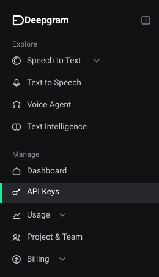
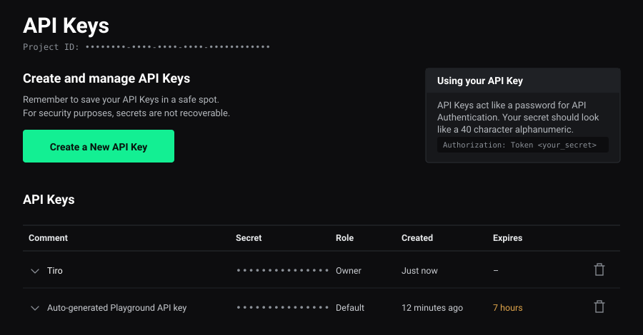
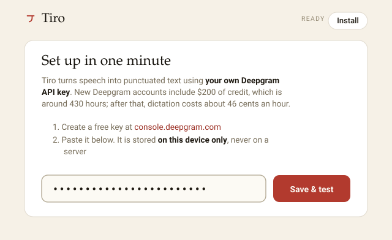

# Getting your Deepgram API key

> There is a friendlier version of this page on the website, at **`/api-key/`**, for anyone who
> would rather not be sent to GitHub to read documentation. Same steps, same pictures. Keep the
> two in step when you change either.

Tiro doesn't have accounts, servers or a subscription. It talks straight to
[Deepgram](https://deepgram.com), the speech-to-text service, using a key that belongs to you.
Getting that key takes about two minutes and needs no credit card.

You only do this once, on one device. After that, Tiro just works.

---

## 1. Make a Deepgram account

Go to **[console.deepgram.com](https://console.deepgram.com)** and sign up. Free, no card.

Somewhere in the signup it asks **"What would you like to explore first?"** and offers Speech to
Text, Text to Speech and Voice agent. Choose **Speech to Text** — that's the one Tiro uses. It
only decides what the dashboard shows you first, so it isn't a decision you can get wrong.

## 2. Open the API Keys page

In the sidebar on the left there's a **Manage** section. **API Keys** is in it, directly under
Dashboard.

## 3. Create a key

Click the green **Create a New API Key**.

- **Name it** anything you'll recognise later. `Tiro` is fine.
- **Expiration: Never.** A key that expires will stop Tiro working on a random Tuesday for no
  visible reason.
- **Ignore "Advanced".** Nothing under it matters here.

Then **Create Key**.

## 4. Copy it straight away

Deepgram shows you the secret **once**. It cannot show it to you again — the console says as
much: *"For security purposes, secrets are not recoverable."* Copy it the moment it appears.

It's a 40-character jumble of letters and numbers. That's what a key looks like; nothing has gone
wrong.

If you close the page before copying it, nothing is broken and nothing is lost — delete that key
with the bin icon on the right and make another. Keys are free and you can have several.

## 5. Paste it into Tiro

Open Tiro, put the key in the field that asks for it, and hit **Save & test**.

Tiro checks the key with Deepgram there and then, and tells you your credit balance if it worked.
Hold the button, say something, and you're done.

---

## If it doesn't work

**"Deepgram rejected this key."** Usually a copy that grabbed a stray space or missed a character
— paste it again. Otherwise check in the console that the key is still listed and hasn't expired.

**Don't use the "Auto-generated Playground API key."** Deepgram makes one for you when you try
the Playground, and it's already sitting in your key list looking like a perfectly good key. It
expires within hours. Make your own, as above.

**You lost the key.** Delete it and make a new one. Ten seconds, no cost, and the old one stops
working the moment it's gone — which is also the fix if you ever paste a key somewhere public.

## The things people reasonably worry about

**Cost.** A new Deepgram account comes with $200 of credit, which is roughly 430 hours of
dictation. After that it's about 46 cents an hour, billed by Deepgram, for the seconds you
actually speak. There's no subscription and nothing renews.

**Where the key lives.** On your own device — the Mac app keeps it in `~/.tiro`, Windows in
encrypted storage, the web app in your browser's local storage. It goes to Deepgram and nowhere
else. Tiro has no server to send it to.

**Keeping it private.** Treat it like a password: it's how Deepgram knows spending is yours. Don't
put it in a screenshot, a chat message or a GitHub issue. If it does get out, delete it in the
console and make another.
