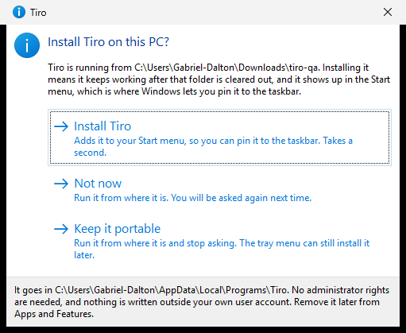
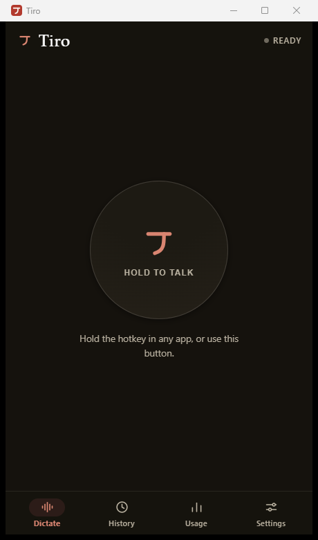
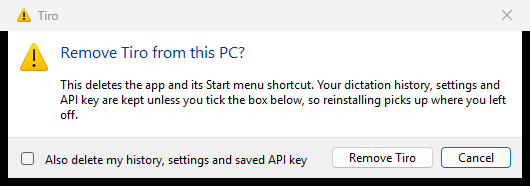

# What this fork adds

For Toby, and for anyone deciding whether any of this is worth taking upstream.

Tiro on macOS is yours and this fork does not touch it. `git diff upstream/main -- Sources/` is
empty, and that is deliberate rather than incidental: the Swift app is carried verbatim so that
anything here can be taken or left without unpicking it from your work.

What the fork adds is the two platforms the macOS app does not reach: **the phone, as a PWA**, and
**Windows, as a WebView2 shell**. Both run the same web core, so they are one product with one
codebase rather than two ports.

---

## The honest limit first

**A PWA cannot type into other apps on iOS.** No global hotkey, no background microphone, no API
for inserting text into another app's field. That is an Apple platform rule, not a gap in the
build, and the paid competitors get around it by shipping a native custom keyboard, which is a
separate product.

So the PWA is scoped as what it can actually be: a fast dictation scratchpad. Hold, speak, and the
transcript is on the clipboard before you switch apps. You paste it yourself. Windows has no such
limit and gets full parity with the Mac.

Saying this out loud in the README, in the app, and here is a deliberate choice. The alternative is
someone discovering it during a demo.

---

## One web core, two clients

`web/` is the whole product interface: the hold-and-tap state machine, the audio pipeline, history,
usage, settings. `web/src/bridge.js` is the only file that knows whether it is running in Safari on
a phone or inside WebView2 on a PC. The Windows side is a shell around it — the global hotkey,
`SendInput`, DPAPI, the tray, the pill — and nothing else.

The reason to mention the architecture at all is that it decides how much of this you could take:
`web/` alone is a self-contained thing that runs on any static host, and it does not need the
Windows half to exist.

---

## Windows

Downloaded as **one EXE**, run from wherever it lands.

On first run it offers to install itself into `%LOCALAPPDATA%\Programs\Tiro`, with a Start menu
entry, an Apps and Features entry, and no administrator rights at any point. Decline and it stays
portable; the tray menu can still install it later. Removing it keeps your history, settings and
API key unless you tick the box that says otherwise.

The app itself is the same web core the phone runs, inside a WebView2 window:

Uninstalling asks once, and asks the question that actually matters rather than burying it:

Two things in here were harder than they look, and both are worth knowing if you ever ship a
Windows build of anything:

- **`PublishSingleFile` does not bundle `Content` items.** The web core and the icons had to become
  embedded resources, and `WebView2Loader.dll` — which the WebView2 package contributes as a
  Content item — silently stayed loose. So the "single file" download was two files, and the EXE on
  its own threw `DllNotFoundException` at the first call into WebView2: a window that never opens.
  It is embedded and loaded by full path now.
- **`InitPropVariantFromString` is not an export of `propsys.dll`.** It is an inline helper in
  `propvarutil.h`. Setting a shortcut's Application User Model ID through it throws every time, and
  because the throw was caught and logged, two releases shipped advertising a taskbar pin with
  nothing in the Start menu to pin.

Both were found by running the app on a real machine after it had been written, reviewed and
approved, and both are now assertions in `Tiro.exe --self-test` that a build agent cannot satisfy
by accident. That is the part worth borrowing: the self-test runs the shipped EXE from a folder
containing nothing else.

### The pill

While you dictate into another app, a small pill shows the waveform, the clock, and buttons to stop
or throw the take away. While the transcript is being fetched, the same strip keeps moving with a
swell crossing it rather than the pill spelling out "Transcribing…", because that is a word to read
at the one moment you have already looked back at what you were dictating into.

---

## The phone

Installed to the Home Screen, the PWA keeps its storage. That is not cosmetic on iOS: Safari can
clear a site's `localStorage` after seven days of not visiting, and that storage holds the Deepgram
key. So installing is the difference between the app remembering you and asking for a key again
next week, and the install flow got more attention than anything else in the web core because of
it.

iOS has no install API at all, so the button opens a walkthrough that **draws Safari's own toolbar**
with the Share button circled — "tap Share" is something you can hold next to your screen and match
rather than a name you have to already know. It asks after the first successful take rather than on
arrival, and other iOS browsers get a Copy link button instead, because Chrome and Firefox on iOS
are Safari's engine without that row in the share sheet.

---

## Smaller things that might be of more use than the platforms

- **Releases are cut from impact notes.** Every pull request that changes something a user would
  notice adds one file to `.changes/` saying what they would notice and how big it is. Merging to
  `main` generates the version, the changelog section, the tag and three downloads in one run. The
  bump decides who gets interrupted: both apps compare versions and interrupt only for a minor or
  major. `.changes/README.md` has the reasoning, including the honest warning that the review of the
  pull request *is* the release review.
- **A Playwright suite that drives the real web core** with a stubbed Deepgram socket and a
  synthetic microphone, so it needs no key, no network and no hardware. It covers the things that
  only break in a browser: the install sheet per platform, a full take, the race where someone taps
  faster than the microphone can open, the service worker offering an update instead of swapping
  itself in, and the accessibility floor measured off the rendered page rather than asserted about
  the source.
- **A standing audit** of all three clients with stable IDs per finding, in `docs/AUDIT.md`,
  including the ones still open.
- **A non-technical guide to getting a Deepgram key**, at `docs/API-KEY.md` and on the site, because
  that step is the hardest thing in the product and the place people give up.
- **Canadian English on by default when the device says Canada**, as a local ruleset over the
  finished transcript rather than a language parameter, with the ambiguous words deliberately left
  alone and named in Settings.

---

## What is not finished

Stated plainly, because you would find all of it in an afternoon:

- **The PWA has not been run on real iOS hardware.** Two Critical findings in `docs/AUDIT.md`
  (PWA-01, PWA-02) both land on the first-run install path, and PWA-01's fix depends on what iOS
  actually does with Home Screen storage.
- **Windows releases are unsigned.** `SIGNPATH_API_TOKEN` is not configured, so SmartScreen
  interrupts the first launch. `docs/SIGNING.md` covers what signing would take.
- **The audit is stale.** It was written against an older commit and its own staleness banner is now
  out of date.
- **There is no in-app updater yet.** The tray notices a new release and opens the GitHub releases
  page, which ordinary people do not use, so in practice nobody updates.
- **`docs/AUDIT.md` MAC-01 is about your app**, and it is the one finding here that touches
  `Sources/`: the pricing constants are roughly 1.8x optimistic, and `DEEPGRAM_PER_MIN` in
  `main.swift` now disagrees with the shared design tokens the other two clients read. It is
  unfixed here precisely because fixing it would mean editing `Sources/`, and this fork's whole
  claim is that it does not.

---

## Pictures still to take

Anyone updating this document: these are drawn from real hardware, never staged or mocked up.

| File | What it should show |
|---|---|
| `windows/pill-recording.png` | The pill mid-take, over another application, waveform moving |
| `windows/pill-transcribing.png` | The same pill with the sweep crossing it |
| `windows/tray-menu.png` | The tray menu open, showing the install and pin items |
| `windows/start-menu.png` | Start search finding Tiro, and the pin-to-taskbar option |
| `windows/apps-and-features.png` | The Apps and Features entry, with version and publisher |
| `phone-home-screen.png` | Tiro installed on an iPhone Home Screen, beside other apps |
| `phone-take.png` | A finished take on the phone, transcript on screen |

Done: `windows/install-prompt.png`, `windows/uninstall-prompt.png`, `windows/app-window.png`. All
three are captures of the running app, not mock-ups.

They are taken with `PrintWindow`, which hands the window a device context and lets it draw itself.
The first attempt read the screen instead, using UI Automation rectangles for the crop, and produced
pictures of the wrong monitor: on a scaled multi-monitor desktop those two live in different
coordinate spaces. `PrintWindow` has no coordinates in it at all, so none of that matters, and it
captures a window that is behind another one.

**The pill cannot be captured without a person**, and that is by design rather than a gap:
`KeyboardHook.cs` ignores injected input, so that the Ctrl+V the app sends to paste a transcript
cannot re-trigger the hotkey. A synthesised Right Alt does nothing at all. The button inside the
window is no way round it either, because WebView2 does not expose its accessibility tree to a plain
client. So the waveform has to be somebody's actual voice, which is the right answer anyway: a
silent take photographs as a flat line.
